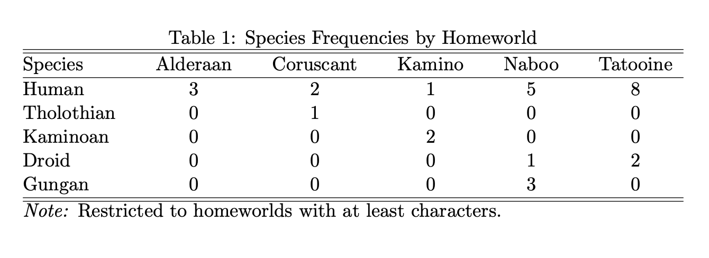

```{r setup, include=FALSE}
knitr::opts_chunk$set(echo = TRUE, message = FALSE, warning = FALSE, eval = FALSE)
```

<!-- badges: start -->
```{r, echo = FALSE, eval = TRUE}
usethis::use_lifecycle_badge("experimental")
```
[](https://lifecycle.r-lib.org/articles/stages.html#experimental)
<!-- badges: end -->

## Overview

## Installation

```{r}
# Install the most recent version of tabtex from GitHub:
install.packages("devtools")
devtools::install_github("nskelley/tabtex")
```

## Getting started

Once it's installed, you can load tabtex with `library(tabtex)`.

```{r}
library(tabtex)
library(dplyr)
library(tidyr)
```

```{r}
starwars_homeworlds <- starwars %>%
  filter(!is.na(homeworld) & !is.na(species)) %>%
  group_by(homeworld, species) %>%
  summarise(spec_hw_freq = n()) %>%
  group_by(homeworld) %>%
  mutate(hw_freq = sum(spec_hw_freq)) %>%
  filter(hw_freq >= 3) %>%
  select(-hw_freq) %>%
  pivot_wider(names_from = homeworld, values_from = spec_hw_freq) %>%
  mutate(across(everything(), ~ ifelse(is.na(.x), 0, .x))) %>%
  rename(Species = species)

starwars_homeworlds
## # A tibble: 5 × 6
##   Species    Alderaan Coruscant Kamino Naboo Tatooine
##   <chr>         <dbl>     <dbl>  <dbl> <dbl>    <dbl>
## 1 Human             3         2      1     5        8
## 2 Tholothian        0         1      0     0        0
## 3 Kaminoan          0         0      2     0        0
## 4 Droid             0         0      0     1        2
## 5 Gungan            0         0      0     3        0
```

```{r}
# this is a mess
tabtex(starwars_homeworlds, title = "Species Frequencies by Homeworld", 
       note = "Restricted to homeworlds with at least three characters.")
## "\\begin{table}[!htbp]\n\\centering\n\\caption{Species Frequencies by Homewor
## ld}\n\\label{}\n\\begin{tabular*}{0.8\\linewidth}{@{\\extracolsep{\\fill}}l*{
## 5}{c}}\n\\hline\\hline\nSpecies & Alderaan & Coruscant & Kamino & Naboo & Tat
## ooine\\\\\n\\hline\nHuman & 3 & 2 & 1 & 5 & 8\\\\\nTholothian & 0 & 1 & 0 & 0
## & 0\\\\\nKaminoan & 0 & 0 & 2 & 0 & 0\\\\\nDroid & 0 & 0 & 0 & 1 & 2\\\\\nGun
## gan & 0 & 0 & 0 & 3 & 0\\\\\n\\hline\\hline\n\\end{tabular*}\n\\begin{minipag
## e}{0.8\\linewidth}\n\\textit{Note:} Restricted to homeworlds with at least th
## ree characters.\n\\end{minipage}\n\\end{table}"

# but when saved...
tabtex(starwars_homeworlds, title = "Species Frequencies by Homeworld", 
       note = "Restricted to homeworlds with at least three characters.",
       out = "demo/out/starwars_homeworlds.tex")
```

We get this output from LaTeX:



